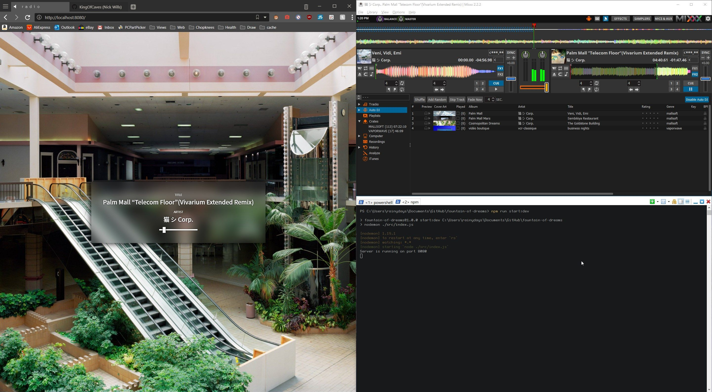
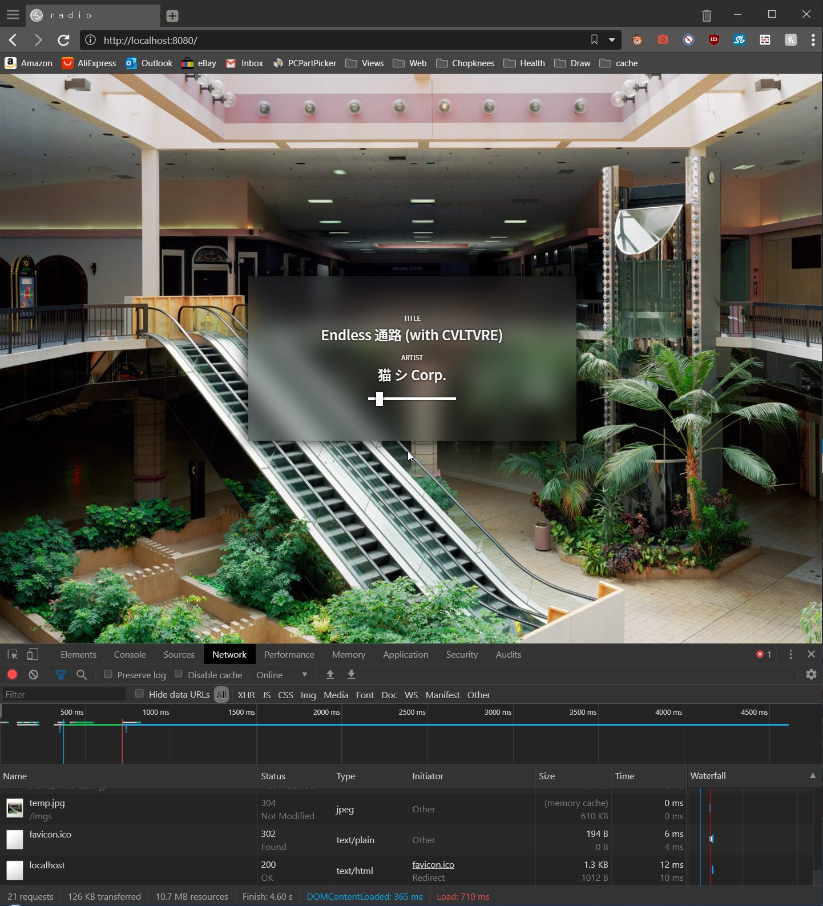

# fountain-of-dreams
 An internet radio with a Node.js backend. Based on the same idea as plaza.one, except more focused on more ambient / melancholic genres.

## TABLE OF CONTENTS
- How it works?
- What needs to be done?
- Screenshots?

## HOW IT WORKS
The main server that people connect to uses a basic frontend for ui and a node.js backend for handeling requests and routes. The backend has a route for the root, a route for handeling the radio server data and current song information and a catch-all so that pepople will get redirected back to the main page. 

The route for the audio stream catches the icecast server being run in the background and uses socket-io in order to emit an event to all connected sockets. This event I conveniently named metadataUpdate sends the metadata from icecast to the front end where it is rendered as a title and an artist. Mixxx is running in the background alongside icecast and is the actualy source of the audio. Icecast is relaying it to the client.

There are plans in the future for a gallery for looking at pictures of abandoned malls that I hand picked from places like r/deadmalls, r/abandonedporn, and Phil Donohue's tumblr/instagram. Props to those guys, a lot of these pictures are amazing. I also want to add a contact form for submitting songs and pictures for others to see and download, with a link to the original post / photographer page / bandcamp of course.

I'll also add a credits page crediting artists and photographers later on when I get to actually hosting the radio on a platform that can be used as a 24/7 host like a miniPC or Raspberry PI. For now I only have screenshots and explanations for what's going on at the moment. I look forward to continue working as this.

## WHAT NEEDS TO BE DONE?
A lot actually. I've really only just gotten started, but the main functionality of the app is already there and works as intended. I need to get this hosted so that people can actually view and listen to the audio stream. What's most important right now is creating the api endpoints, the ui/frontend can come later on. 

The aero-like design I'm using right now isn't final, it's temporary. I might add something like different themes later.  I will definitely add more background options to use just like plaza-one.

## SCREENSHOTS?
hello yes here is some pictor

